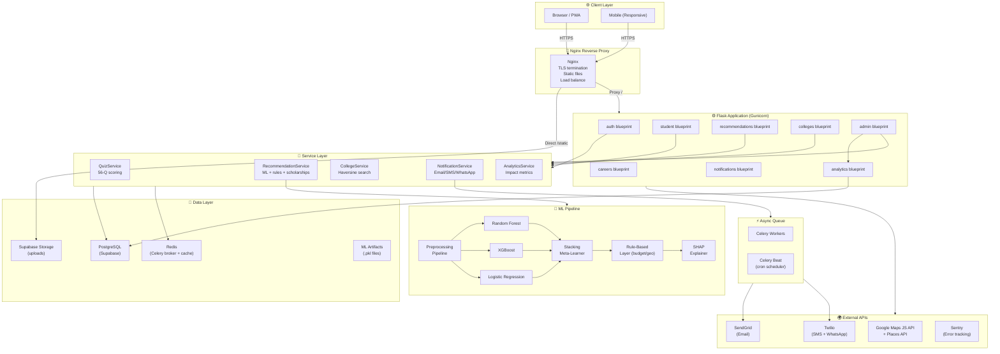
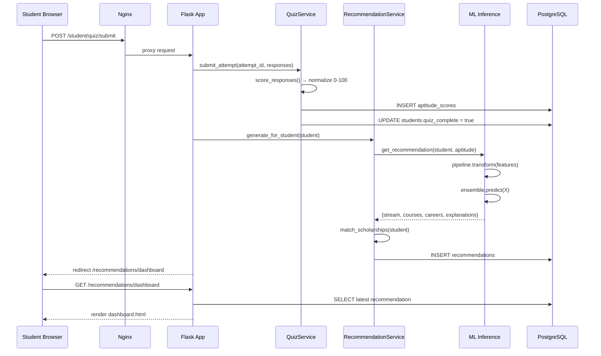
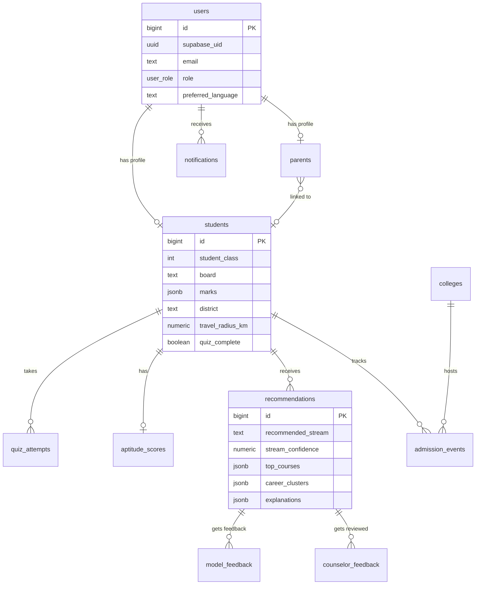
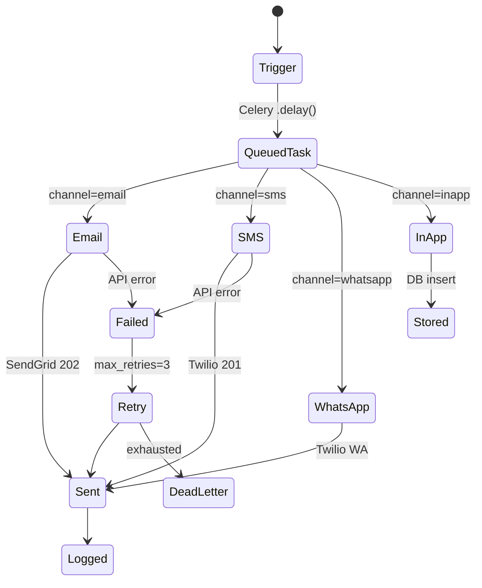

# System Architecture — CareerGuide India

## High-Level Architecture

---

## Request Flow — Student Getting Recommendations

---

## ML Ensemble Architecture

```mermaid
graph LR
    subgraph Input["Input Features (40+)"]
        M["Marks (9 subjects)"]
        A["Aptitude scores (6 dims)"]
        I["Interests (16 binary)"]
        C["Constraints (budget, travel, hostel)"]
        D["Demographics (board, school type)"]
    end

    subgraph Preprocessing["Preprocessing Pipeline"]
        ME["MarkFeatureEngineer<br/>(aggregate, tier)"]
        AE["AptitudeEngineer<br/>(composite, STEM/Humanities)"]
        CE["CategoricalEncoder<br/>(LabelEncoder)"]
        IN["IncomeNormalizer<br/>(log1p)"]
        CS["ColumnSelector + StandardScaler"]
    end

    subgraph Ensemble["Stacking Ensemble (per task)"]
        RF["RandomForest<br/>n=200, depth=12"]
        XGB["XGBoost<br/>n=150, lr=0.1"]
        LR["LogisticRegression<br/>(calibrated)"]
        META["Meta-Learner<br/>LogisticRegression<br/>(5-fold CV)"]
        CAL["Platt Calibration<br/>(confidence scores)"]
    end

    subgraph Output["Top-K Output"]
        S["Stream Rank (Top 4)"]
        CO["Course Rank (Top 5)"]
        CA["Career Rank (Top 5)"]
        EX["SHAP Explanations"]
    end

    Input --> Preprocessing
    Preprocessing --> RF & XGB & LR
    RF & XGB & LR --> META
    META --> CAL
    CAL --> Output
```

---

## Database Entity Relationship

---

## Notification Event Flow

